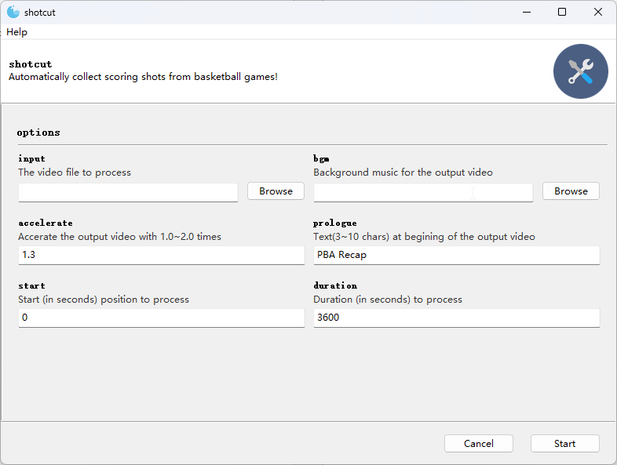

# shotcut

## Overview
This software has been specifically developed to employ object detection and tracking techniques, enabling it to  detect and track scoring shots during basketball games.
- Identifies and accurately detects basketballs and hoops in video frames.
- Tracks the movement of the basketball and hoop throughout the entire video.
- Analyzes the interaction between the basketball and the hoop, determining whether a successful scoring shot has been made.
- Collects all scoring shot clips and combines them seamlessly into the final output video.

### GUI

### Options
- Support to add background music and it will loop over the output video. 
- Provide arguments to accelerate the output video.
- Provide arguments to set the start poistion and duration of input video for processing.

### Demo Output

### Notes
- After you click on the **start** button on the UI, you may need to wait for a while(**~1 minute**) for the software to decompress and initiate, and then you will see some progress in the processing.
- There will be two output files after the processing. They will be located in the same directory of the input video, with the suffixes **".hit"** and **".hit_bgm"**, respectively.
- The timestamp in the output video is inferred from the video's creation time. 

## Limitations:
- Only supports the video recorded by **stationary camera**.
- Only available as a Windows executable binary.
- The training dataset used contains a relatively small number of basketball court.
- The perfomance will be degraded in other basketball court.

## Credits
I would like to express my gratitude to the PBA team (a group of amateur basketball enthusiasts) and teammates who have played basketball together with. A special thanks goes to Zhang Tao for recording the videos every time, which has enabled me to complete the initial concept validation as well as the subsequent performance benchmark. It's because of our shared passion for basketball that I have developed this.

## License
This software is licensed under the [MIT License](LICENSE).
